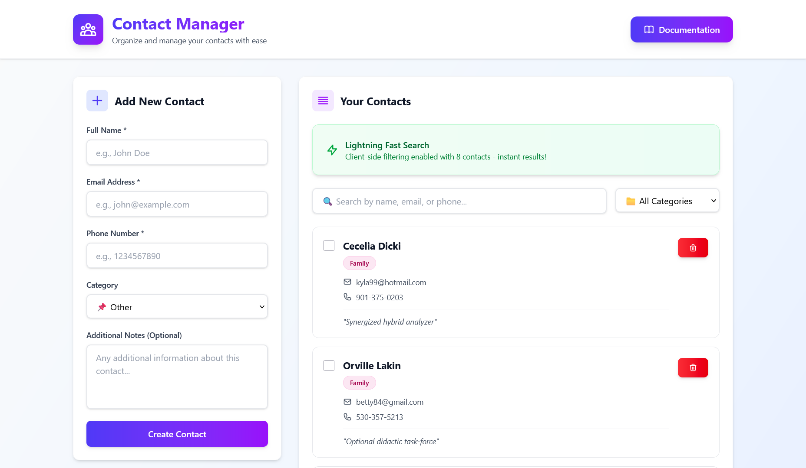

# Contact Management Web Application

A modern, full-stack contact management system with real-time search, filtering, and CRUD operations. Built with React, Node.js, Express, and MongoDB.

🔗 **Live Demo:** [https://contact-management-web-app-theta.vercel.app](https://contact-management-web-app-theta.vercel.app)

## 📸 Preview




## ✨ Features

- ✅ **CRUD Operations** - Create, Read, Update, Delete contacts
- 🔍 **Smart Search** - Client-side filtering for datasets ≤1000 contacts, instant results
- 🏷️ **Category Filtering** - Organize contacts by Work, Family, Friends, Other
- 📱 **Phone Validation** - Strict validation with international format support
- 📧 **Email Validation** - RFC-compliant email validation
- 📄 **Pagination** - Efficient pagination with 10 items per page
- ✅ **Bulk Operations** - Select and delete multiple contacts at once
- 🎨 **Modern UI** - Clean, responsive design with Tailwind CSS
- ⚡ **Fast Performance** - React Query caching and optimistic updates
- 🔒 **Secure** - Helmet.js security headers, CORS protection
- ✅ **Full Validation** - Zod validation on both client and server

## 🛠️ Tech Stack

### Frontend
- **React 19** - UI library
- **TypeScript** - Type safety
- **Vite** - Build tool and dev server
- **TanStack React Query** - Data fetching and caching
- **React Hook Form** - Form management
- **Zod** - Schema validation
- **Axios** - HTTP client
- **Tailwind CSS v4** - Styling
- **Lucide React** - Icons

### Backend
- **Node.js** - Runtime environment
- **Express.js** - Web framework
- **TypeScript** - Type safety
- **MongoDB + Mongoose** - Database and ODM
- **Zod** - Schema validation
- **Helmet.js** - Security middleware
- **CORS** - Cross-origin resource sharing

### Deployment
- **Frontend:** Vercel
- **Backend:** Railway
- **Database:** MongoDB Atlas

## 📁 Project Structure

```
C.M.W.A/
├── client/                      # React frontend
│   ├── src/
│   │   ├── features/
│   │   │   └── contacts/
│   │   │       ├── api/         # API service layer
│   │   │       ├── components/  # Contact components
│   │   │       ├── hooks/       # React Query hooks
│   │   │       └── validation/  # Zod schemas
│   │   ├── lib/                 # Axios configuration
│   │   ├── types/               # TypeScript types
│   │   ├── App.tsx
│   │   └── main.tsx
│   └── package.json
│
├── server/                      # Node.js backend
│   ├── src/
│   │   ├── controllers/         # Request handlers
│   │   ├── services/            # Business logic
│   │   ├── models/              # Mongoose schemas
│   │   ├── routes/              # API routes
│   │   ├── validators/          # Zod schemas
│   │   ├── middlewares/         # Error handling, validation
│   │   ├── db/                  # MongoDB connection
│   │   └── index.ts
│   └── package.json
│
├── docs/                        # Documentation (GitHub Pages)
├── README.md
├── VERCEL_RAILWAY_DEPLOYMENT.md
└── package.json                 # Root package.json
```

## 🚀 Getting Started

### Prerequisites
- Node.js 20+
- npm or yarn
- MongoDB Atlas account (free tier)

### Local Development Setup

1. **Clone the repository**
   ```bash
   git clone https://github.com/yourusername/ContactManagementWebApp.git
   cd ContactManagementWebApp
   ```

2. **Install dependencies**
   ```bash
   npm run install:all
   ```

3. **Setup environment variables**
   
   Create `server/.env`:
   ```env
   PORT=5000
   CORS_ORIGIN=http://localhost:5173
   MONGODB_URI=your_mongodb_connection_string
   NODE_ENV=development
   ```

   Create `client/.env`:
   ```env
   VITE_API_URL=http://localhost:5000/api/v1
   ```

4. **Start development servers**
   ```bash
   npm run dev
   ```
   
   This runs both frontend (http://localhost:5173) and backend (http://localhost:5000)

### Alternative: Run Separately

```bash
# Terminal 1 - Backend
npm run dev:server

# Terminal 2 - Frontend
npm run dev:client
```

## 📚 API Documentation

### Base URL: `/api/v1`

#### Health Check
- **GET** `/healthcheck` - Check API status

#### Contacts

| Method | Endpoint | Description | Body |
|--------|----------|-------------|------|
| GET | `/contacts` | Get all contacts with pagination | - |
| GET | `/contacts/:id` | Get single contact | - |
| POST | `/contacts` | Create new contact | `{ name, email, phone, category, message? }` |
| PUT | `/contacts/:id` | Update contact | `{ name?, email?, phone?, category?, message? }` |
| DELETE | `/contacts/:id` | Delete contact | - |
| POST | `/contacts/bulk-delete` | Delete multiple contacts | `{ ids: string[] }` |

#### Query Parameters

**GET /contacts**
- `page` (number, default: 1) - Page number
- `limit` (number, default: 10, max: 5000) - Items per page
- `search` (string, optional) - Search by name, email, or phone
- `category` (string, optional) - Filter by category: Work, Family, Friends, Other

#### Request/Response Examples

**Create Contact:**
```json
POST /api/v1/contacts
{
  "name": "John Doe",
  "email": "john@example.com",
  "phone": "+1234567890",
  "category": "Work",
  "message": "Important client"
}
```

**Response:**
```json
{
  "success": true,
  "data": {
    "_id": "507f1f77bcf86cd799439011",
    "name": "John Doe",
    "email": "john@example.com",
    "phone": "+1234567890",
    "category": "Work",
    "message": "Important client",
    "createdAt": "2026-01-03T10:00:00.000Z",
    "updatedAt": "2026-01-03T10:00:00.000Z"
  },
  "message": "Contact created successfully"
}
```
